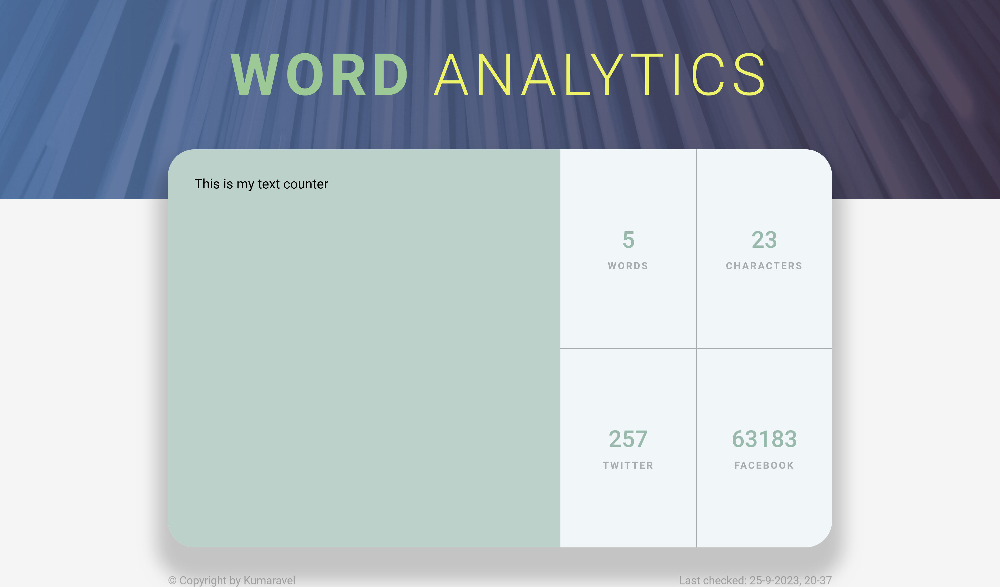
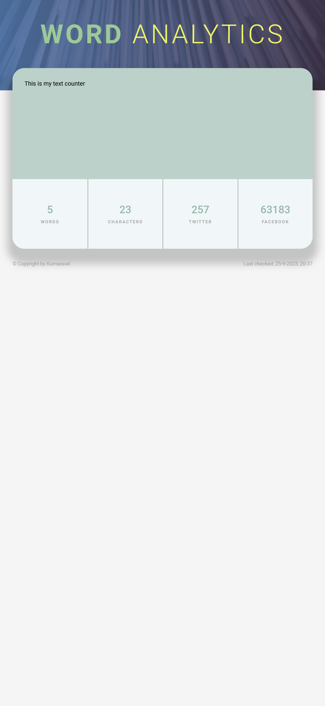

# Word Analytics

## Table of Contents

- [Overview](#overview)
- [Features](#features)
- [Project Structure](#project-structure)
- [Getting Started](#getting-started)
- [Technologies](#technologies)
- [Screenshots](#screenshots)
- [Links](#links)
- [Contributing](#contributing)

## Overview

This web application is thoughtfully crafted to empower users with the ability to effortlessly input text, after which the application performs a dual function: meticulously counting both words and characters.

## Features

1. Word Count: Find out how many words are in your text.
2. Character Count: Get the total character count of your input.
3. Facebook Limit: See how many characters you have left before reaching the maximum for Facebook posts.
4. Twitter Limit: Keep track of remaining characters for Twitter posts.

## Project Structure

The project is structured as follows:

word-analytics/

- `app/`: Directory containing JavaScript files.
  - `app.js`: Main JavaScript logic and interaction
- `styles/`: Directory containing CSS and SCSS files for styling.
  - `style.css`: Compiled CSS file.
  - `style.scss`: SCSS source file.
  - `style.css.map`: Source map for SCSS to CSS mapping.
  - `animation.scss`: Application animations
  - `extends.scss`: SCSS extensions
  - `global.scss`: Global SCSS setup for the application
  - `mixins.scss`: SCSS mixins
  - `variables.scss`: SCSS variables
- `index.html`: The main HTML file that contains the structure of the app.
- `readme.md`: The README file containing project information and instructions.

## Getting Started

1. Clone this repository: `git clone <repository-url>`
2. Open the `index.html` file in a web browser.
3. Start adding, editing, and managing your tasks!

## Technologies

This project uses the following technologies:

1.  Semantic HTML5: Provides a structured and accessible foundation for the application.
2.  SCSS: Utilizes the power of SCSS for efficient and maintainable CSS styling, following the BEM methodology and architecture.
3.  Vanilla JS: Implements core functionality with plain JavaScript.

## Screenshots

## Links

solution url: https://meek-cannoli-c4bf3b.netlify.app/

## Contributing

Contributions are welcome! If you find any issues or have ideas for improvements, feel free to submit a pull request.
